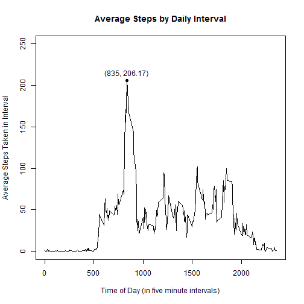

## 0. Loading and preprocessing the data

0.1. Set your working directory using setwd()

0.2. Unzip and read data into R


```r
unzip("activity.zip", exdir=".")
activity <- read.csv("activity.csv")
```

0.3. Clean the data

```r
activity$date <- as.Date(activity$date, "%Y-%m-%d") # format as date
```

## 1. What is mean total number of steps taken per day?

1.1. Sum steps by date 

```r
library(plyr)
activitySum <- ddply(activity, .(date), summarize, 
        dailySteps=sum(steps, na.rm=TRUE)) 
```

1.2. Plots histogram of mean total steps

```r
xaxis <- c(0, 22000) 
yaxis <- c(0,12)
hist(activitySum$dailySteps, breaks=25, 
        main = "Total Daily Steps", xlab= "Total Steps in One Day", 
        ylab="Frequency (Days)", 
        xlim=xaxis, ylim=yaxis) 

abline(v=mean(activitySum$dailySteps), col="red", lty=2) # add v line for mean
text(9354.23,8.5, "mean = 9354.23", pos=3, col="red", srt=90) # label mean line
abline(v=median(activitySum$dailySteps), col="blue", lty=2) # add v line for med
text(10395,8.5, "median = 10395", pos=3, col="blue", srt=90) # label median line
```

 

The mean total number of steps taken per day is 9354.23.  
The median total number of steps taken per day is 10395.


## 2. What is the average daily activity pattern?
2.1. Compute mean steps by interval 

```r
activityPattern <- ddply(activity, .(interval), summarize, 
        avgSteps=mean(steps, na.rm=TRUE)) # avg steps by interval
```

2.2. Make time series (line graph) of steps by interval

```r
yaxis3=c(0, 250)
plot(activityPattern$interval, activityPattern$avgSteps, type="l", 
        main = "Average Steps by Interval", 
        xlab="Time of Day", 
        ylab= "Average Steps Taken in Interval", # line plot
        ylim=yaxis3)

subset(activityPattern$interval, 
       activityPattern$avgSteps==max(activityPattern$avgSteps)) 
```

```
## [1] 835
```

```r
text(835, max(activityPattern$avgSteps), "(835, 206.17)", pos=3) 
points(835, 206.17, pch=19) # plot and label max steps point
```

 

Averaged across all days in the dataset, the five-minute interval with the maximum
number of steps is the interval 835, or 8:35-8:40AM. 

## 3. Imputing missing values

3.1. Are missing values spaced randomly or are entire days missing?


```r
sum(is.na(activity$steps)) # returns missing num of steps values
```

```
## [1] 2304
```

```r
means <- ddply(activity, .(date), summarize, 
               dailySteps=mean(steps, na.rm=TRUE)) # mean steps by day
sum(is.na(means$dailySteps)) # returns number of days with all steps data missing
```

```
## [1] 8
```

```r
length(unique(activity$interval)) # returns number of intervals in a day
```

```
## [1] 288
```
There are 2304 missing values. Note that there are 288 intervals in a day times 
8 days completely missing = 2304 missing values; all missing values are from 
completely empty days.  

3.2. Replace NA's with interval means from the whole data set

```r
activity$steps[is.na(activity$steps)] <- ave(activity$steps, activity$interval, 
    FUN=function(x)mean(x, na.rm=T))[is.na(activity$steps)] 
sum(is.na(activity$steps)) # returns number missing values after replacement
```

```
## [1] 0
```
There are now zero missing values.   

3.3. Sum steps by date, with missing values imputed

```r
activitySum2 <- ddply(activity, .(date), summarize, 
        dailySteps=sum(steps, na.rm=TRUE)) 
```

3.4. Plot histogram of total steps per day

```r
xaxis2 <- c(0, 25000) 
yaxis2 <- c(0,20)
hist(activitySum2$dailySteps, breaks=25, 
     main = "Total Daily Steps - Missing Data Imputed", 
     xlab= "Total Steps in One Day", ylab="Frequency (Days)",
     ylim = yaxis2, xlim=xaxis2) # histogram

mean(activitySum2$dailySteps) 
```

```
## [1] 10766.19
```

```r
median(activitySum2$dailySteps) 
```

```
## [1] 10766.19
```

```r
abline(v=mean(activitySum2$dailySteps), col="red", lty=2) #add v line for mean
text(10766.19,18, "mean = median = 10766.19", pos=3, col="red") #label mean line
```

 

Interpretation: imputing missing values makes the mean equal to median equal to 
1.0766 &times; 10<sup>4</sup>because the imputation process used here sets 
entire days of missing values equal to the by-interval mean. Recall that this is
so because all missing values come from days that are entirely missing 
number-of-steps data.   

Thus,the mean steps on dayscomposed entirely of imputed missing values becomes the 
mean of all days. Because eight days,  sitting right in the middle of the
number-of-steps distribution now take on that mean daily value,
1.0766 &times; 10<sup>4</sup> becomes the median as well.

Additionally, both mean and median are larger now than when NA's were ignored 
because those days previously contributed zero to the overall mean?

## 4. Are there differences in activity patterns between weekdays and weekends?

4.1. Extract day of week from date into a new factor variable

```r
activity$dayOfWeek <- weekdays(activity$date, abbreviate = FALSE) #get days
activity$weekendWeekday = as.factor(ifelse(activity$dayOfWeek=="Sunday" | 
        activity$dayOfWeek=="Saturday","weekend", "weekday")) #create new var 
```

4,2. Compute average steps per intervals across weekdays, weekends

```r
activityDays <- ddply(activity, .(interval, weekendWeekday), summarize, 
        avgSteps=mean(steps))
```

4.3. Make a time series (line plot) of steps by interval, by wkend/wkday

```r
library(ggplot2) 
library(grid)
g <- qplot(interval, avgSteps, data=activityDays, facets = weekendWeekday~.)
g2 <- g + geom_line(colour="blue") + 
        labs(x="Interval", y="Number of Steps", title="Weekday and Weekend Activity") + 
        theme_bw() # with ggplot2 
g2 +    theme(
        plot.margin = unit(c(2,2,2,2), "cm"),
        plot.title=element_text(vjust=1.5))
```

 

There is a more pronounced activity spike between the 800 and 900 intervals of 
weekday days, corresponding to 8:00-9:00 AM, compared to weekend days, 
likely due to morning work preparations on weekdays only. 

